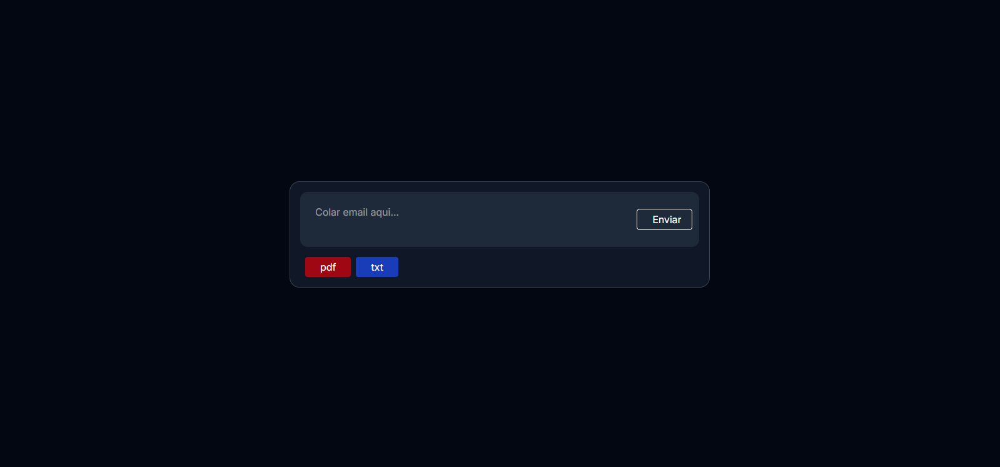
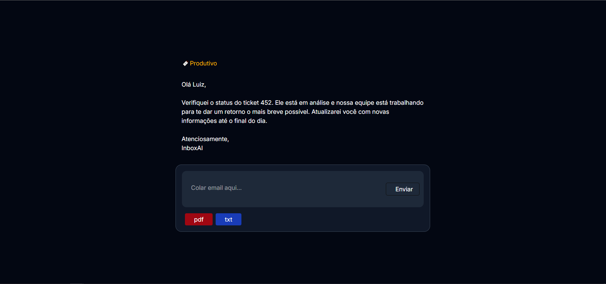

# InboxIA
### Descrição:
Uma aplicação web que utiliza inteligência artificial para classificar emails e sugerir respostas automáticas, economizando tempo da equipe e automatizando processos repetitivos.

### Requisitos:
- python3
- Node.js:22

### Stack: 
- FastAPI
- React.js
- Vite

# Backend:
## Rotas da API

#### Gerar resposta via texto
- **`POST`** "/api/generateEmailResponse"<br>
    - **Descrição:** Gera resposta para um input de texto.
    - **Parametros (Body JSON):**
        - prompt: texto do email
      #### Exemplo:
        ``` bash
        {
            "prompt": "email"
        }
        ```

#### Gerar resposta via arquivo
- **`POST`** "/api/processFileToPrompt"<br>
    - **Descrição:** Gera resposta para um arquivo.
    - **Tipos de arquivo:** .pdf ou .txt
    - **Parametros (Body multipart/form-data):**
        - file: arquivo a ser processado

#### Documentação (swagger)
- **`GET`** "/docs"<br>
    - **Descrição:** Documentação da API via swagger.

## Como executar:
- Setup
``` bash
git clone https://github.com/luiz-github/InboxAI

cd .\InboxAI\backend\

py -m venv venv

.\venv\Scripts\activate

pip install -r requirements.txt

```
- Criar arquivo .env em ./InboxIA/backend

``` bash
API_KEY=CHANGE-ME
BASE_URL=CHANGE-ME
```

- Executar
``` bash
fastapi run main.py
```

## Frontend:
## Interface:

- Exemplo de saida:<br>


## Como executar:
- Setup
``` bash
git clone https://github.com/luiz-github/InboxAI

cd .\InboxAI\frontend\

npm i
```

- Criar arquivo .env em ./InboxIA/frontend
``` bash
VITE_BASE_URL=CHANGE-ME
```

- Executar
``` bash
npm run dev
```